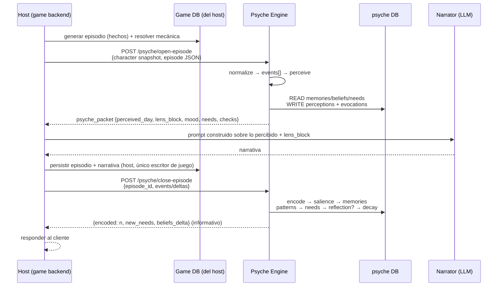
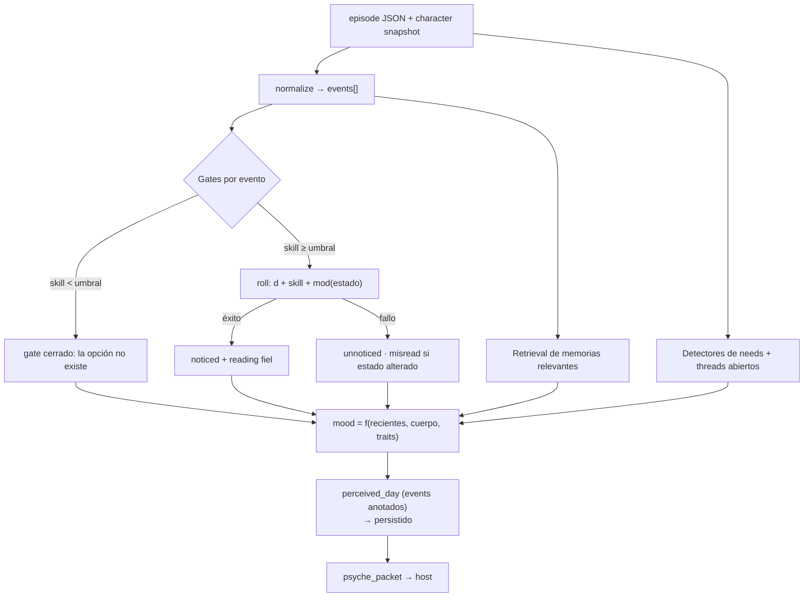
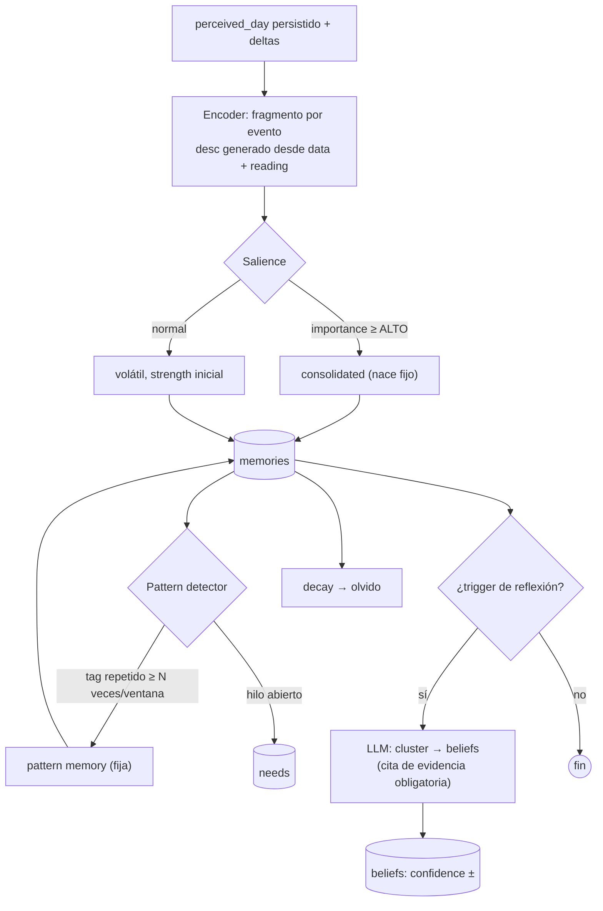

# Psyche Engine — Especificación técnica

**Qué es**: un módulo de servicio (Python/FastAPI) que simula la vida interior de un personaje: cómo percibe el mundo, qué recuerda, qué cree, qué necesita y cómo se siente. Se interpone entre los hechos del mundo (que produce el backend del juego) y la narración (que produce un LLM): el narrador no recibe el mundo crudo, recibe **el mundo tal como ese personaje lo vivió**.

**Qué no es**: no es un motor de juego, no decide qué pasa en el mundo, y no escribe estado de juego. No es un wrapper de LLM: la mayoría de sus operaciones son deterministas.

---

## 1. Principios de diseño

| Principio | Implicación |
|---|---|
| **Agnóstico del juego** | El módulo solo conoce un contrato de entrada (`events[]`) y uno de salida (`psyche_packet`). Los detalles del setting viven en el `data` de cada evento y en adapters por juego. |
| **La psique es dueña de su propia data** | Memorias, creencias, necesidades y mood son datos *del cerebro*: viven en una DB/schema propio (`psyche.*`) que solo este módulo escribe. El estado mecánico del juego (hp, energía, inventario, posición) es del host y llega como snapshot de solo lectura. |
| **Determinista por defecto, LLM cuando suma** | Encoding, retrieval, needs, gates, mood y el lente son reglas y scoring. El LLM solo aparece en la reflexión/consolidación (y ni siquiera todos los días). |
| **El olvido es un feature** | Los recuerdos decaen si no se evocan. Un cerebro que lo recuerda todo es un log, no una mente. |
| **Degradación elegante** | Si el módulo está caído, el host narra igual, sin lente. Nunca bloquea el juego. |
| **Idempotente** | Reprocesar un día no duplica recuerdos ni re-percibe eventos. Todo se clavea por `(character_id, episode_id)`. |

## 2. Conceptos

| Concepto | Definición | Analogía |
|---|---|---|
| **Event** | Unidad de experiencia: algo que le pasó al personaje, con `type`, `when`, `where`, `data`. | Estímulo sensorial |
| **Perception** | El resultado de pasar un evento por los gates y el estado interno: `noticed` / `unnoticed` / `misread` + un `reading` (cómo lo interpretó). | Percepción |
| **Memory** | Un evento percibido que superó el umbral de atención y quedó registrado, con valencia, importancia y fuerza que decae. | Memoria episódica |
| **Pattern memory** | Memoria fija creada por repetición de eventos triviales similares ("lleva lloviznando toda la semana"). | Memoria de hábito/tema |
| **Belief** | Conocimiento consolidado con `confidence` y evidencia (ids de memorias). Puede reforzarse, debilitarse o invertirse. | Memoria semántica |
| **Need** | Un hilo abierto que exige resolución: fisiológico (hambre), obligación (una promesa), encuentro sin cerrar, meta. | Motivación / open loop |
| **Mood** | Capa afectiva rápida: `{valence, arousal, dominant}`. Cambia por episodio. | Estado de ánimo |
| **Traits** | Parámetros estables del molde del cerebro (0..1): sesgan salience, valencia y gates. | Personalidad |
| **Lens** | El texto que resume todo lo anterior para el narrador: cómo ve el mundo el personaje *hoy*. | Foco atencional |
| **Perceived day** | El `events[]` de entrada anotado con percepción — lo que el narrador recibe en lugar de los hechos crudos. | Experiencia subjetiva |

## 3. Contrato de entrada — `events[]`

El host no le manda "el mundo"; le manda **un stream plano de experiencias** del episodio (un día, una escena). Todos los elementos son hermanos con la misma envoltura:

```jsonc
{
  "type": "climate" | "encounter" | "terrain" | "place" | "water"
        | "meal" | "rest" | "travel" | "body" | "region" | ...,  // extensible
  "when":  { "episode": 2, "date": "1950-01-19", "hour": 10.0, "phase": "morning" },
  "where": { "region": "...", "family": "...", "point": [x, y] },
  "data":  { ... }   // libre: los hechos duros del juego
}
```

- **`type`**: vocabulario fijo y genérico (la lista de arriba cubre viajes/supervivencia; otros juegos la extienden). Es lo único que el núcleo interpreta estructuralmente.
- **`when`**: fecha/hora/fase dentro de la ficción — el cerebro necesita saber *en qué momento* pasó cada cosa para ordenar memorias y detectar repeticiones.
- **`where`**: contexto espacial/social izado a la envoltura (región, cultura, coordenadas) para que cualquier evento sea localizable sin conocer el esquema del juego.
- **`data`**: hechos duros, libres por type. El módulo no necesita entenderlos semánticamente: los usa para tags, salience y para generar el `desc` del recuerdo.
- **`body`** es un type especial: el cuerpo reportando (energía, heridas, días sin comer/beber). La mente recibe señales del cuerpo como un evento más.

### 3.1 Normalización

El host puede emitir `events[]` nativamente, o mandar su JSON de episodio crudo y dejar que un **adapter por juego** (`psyche/normalize/<game>.py`) lo traduzca. El adapter es la única pieza que conoce el esquema del juego; el núcleo solo ve `events[]`.

## 4. Contrato de salida — `psyche_packet`

Antes de narrar un episodio, el host llama `open-episode` y recibe:

```jsonc
{
  "perceived_day": [              // events[] anotados — el narrador consume ESTO
    {
      "type": "encounter",
      "perception": "noticed",    // noticed | unnoticed | misread
      "reading": "leyó las huellas: caravanas con escolta defensiva",
      "salience": 0.8,
      "evoked": ["mem_123"]       // memorias que este evento disparó
    }
  ],
  "lens_block": "=== THE MIND OF X ===\n...",   // texto listo para el prompt
  "mood": {"valence": -0.3, "arousal": 0.2, "dominant": "weariness"},
  "needs_active": [ {"type": "physiological", "description": "...", "urgency": 0.9} ],
  "check_results": [ {"gate": "track", "roll": 7, "total": 14, "success": true} ]
}
```

El `lens_block` es una sección de prompt renderizada por templates: mood, creencias relevantes, memorias evocadas como *impresiones* (no hechos), e intenciones abiertas.

## 5. El ciclo de vida de un episodio



**Regla temporal**: dos llamadas por episodio. `open` antes de narrar (lee mucho, escribe poco: percepciones y contadores de evocación). `close` después de persistir (escribe todo el aprendizaje). Si el host no llama `close`, el cerebro simplemente no recuerda ese episodio — no hay inconsistencia.

## 6. Internos — percepción (`open-episode`)



### 6.1 Gates y rolls

- **Gate**: requisito estático — `skill_x ≥ umbral` hace que el intento *exista*. Debajo del umbral no hay roll: el personaje ni lo intenta.
- **Roll**: `d10 + skill + modificadores_de_estado` vs `difficulty`. El estado (cansancio, corrupción, ánimo) modifica la tirada.
- **Efecto del resultado** — sobre la *percepción*, no sobre la mecánica:
  - éxito → `noticed`: interpreta el evento correctamente; sube su salience.
  - fallo → `unnoticed`: el evento ocurre pero el personaje no lo registra conscientemente (puede quedar como malestar difuso).
  - fallo + estado alterado (miedo/sombra) → `misread`: percibe algo *equivocado* — la huella se vuelve presagio.
- **Invariante de coherencia**: un check jamás puede producir un outcome material que la mecánica no produjo. Puede narrar "leyó el rastro"; no "consiguió comida". (La agencia real es una extensión futura vía *proposed commands*.)

## 7. Internos — consolidación (`close-episode`)



### 7.1 Salience (qué merece ser recuerdo)

Cada evento percibido recibe `importance ∈ [0,1]` por reglas:

```
importance = clamp01(
    w1 · max(severity de data)          # peligro, daño, extremos climáticos
  + w2 · novelty                         # primera vez con ese tag/entity (lookup en memories)
  + w3 · emotional_charge                # outcomes, threads, necesidades afectadas
  + w4 · trait_bias(traits, event)       # un miedoso pondera más las amenazas
  + w5 · perception_bonus                # noticed con roll difícil > pasivo
)
```

- `importance ≥ FIXED_THRESHOLD` → nace `consolidated` (no decae). Ejemplos: encuentro mortal, promesa, primer contacto.
- Resto → volátil con `strength = f(importance)` inicial.

### 7.2 Decaimiento y olvido

Por cada `close-episode`: `strength *= DECAY` para memorias no consolidadas y no evocadas ese episodio. `strength < FORGET_THRESHOLD` → se borra. Valores guía: `DECAY ≈ 0.85`, `FORGET_THRESHOLD ≈ 0.2`.

### 7.3 Tres caminos a la permanencia

1. **Nace fijo** — importance alta al encodear.
2. **Promovido por patrón** — el detector agrega volátiles con tags repetidos en una ventana (ej. mismo `weather:*` en ≥3 de los últimos 4 episodios, misma comida, N asentamientos esquivados) y crea una memoria `kind='pattern'` fija que representa el *tema*. Los fragmentos individuales pueden seguir muriendo: lo que persiste es la repetición.
3. **Consolidado por uso** — `evocations ≥ K`, o citada como evidencia por una belief → `consolidated=true`.

### 7.4 Reflexión → beliefs (la única pieza LLM)

Cuando hay trigger (cada K episodios, o un evento/patrón de importance alta):

1. Se juntan las memorias evocadas recientemente + las de importance alta.
2. Una llamada LLM las agrupa en candidatos a creencias: `{kind: world|self|other, statement, confidence, evidence: [memory_ids]}`.
3. Se reconcilian con beliefs existentes: refuerzo (`confidence +δ`), contradicción (`confidence −δ` o `status=weakened`), creación nueva, o inversión (una belief contradicha muchas veces puede dar vuelta el signo — *crecimiento*; una de valencia negativa que se refuerza mucho — *trauma*).
4. Regla anti-alucinación: **ninguna belief sin `evidence`** apuntando a memorias reales. Cap de beliefs activas (~10–15); `confidence` decae sin refuerzo.
5. Se regenera `profile.lens_text` y el mood baseline.

## 8. Retrieval (dentro de `open-episode`)

Score de cada memoria frente al contexto del episodio:

```
score = α·recency + β·importance + γ·relevance
  recency   = exp(-λ · episodios_desde_que_pasó)
  relevance = overlap(tags, entities, region, biome, clima, needs activas)
  α,β,γ tunables; v1 sin embeddings — pgvector opcional después
```

Top-K pasan al lente como impresiones y reciben `evocations++`, `strength += boost` (la única escritura del camino de lectura).

## 9. Necesidades (`needs`)

Dos fuentes, ambas deterministas:

- **Detectores de estado** (del evento `body` y contadores del profile): días sin comer/beber, fatiga acumulada, monotonía de dieta, asentamientos esquivados, streaks de clima hostil. Cada detector define cuándo abre una need, su `urgency` creciente y cuándo se cierra.
- **Threads narrativos** (de eventos percibidos): una promesa, un encuentro sin resolver, un pedido, un peligro avistado. Se anclan a `entity_id`/`region`/episodio.

Las needs abiertas salen en el packet como **intenciones** ("resolver el hambre", "¿en qué quedó lo del hobbit?") que el narrador puede hacer actuar en la prosa — sin tocar mecánica.

## 10. Modelo de datos

```sql
psyche.memories     (id, character_id, episode_ids..., kind, tags jsonb,
                     entity_id, region, location_id, desc, valence,
                     importance, strength, evocations, last_evoked_episode,
                     consolidated, embedding?)

psyche.perceptions  (character_id, episode_id, events jsonb)   -- perceived_day

psyche.beliefs      (id, character_id, kind, statement, confidence,
                     evidence jsonb, status, formed_episode, updated_episode)

psyche.needs        (id, character_id, type, description, urgency, status,
                     source jsonb, linked_entity, opened_episode,
                     due_episode, resolution jsonb)

psyche.profiles     (character_id pk, traits jsonb, mood jsonb,
                     lens_text, diet_history jsonb, counters jsonb)
```

## 11. API

| Endpoint | Input | Output | Escribe |
|---|---|---|---|
| `POST /psyche/open-episode` | `{character, episode JSON}` | `psyche_packet` | perceptions, evocations |
| `POST /psyche/close-episode` | `{episode_id, events, deltas}` | resumen informativo | memories, needs, beliefs, profile |
| `GET /psyche/state/:id` | — | memorias/beliefs/needs/mood | — (debug/inspección) |
| `POST /psyche/decide` *(futuro)* | contexto + opciones | `proposed_commands` | — (propone, el host aplica) |

## 12. Contrato con el host (resumen)

El host debe:

1. Emitir el episodio como `events[]` (o proveer un adapter de normalización).
2. Incluir el snapshot del personaje (skills, recursos, condiciones) en `open-episode` — el módulo no lo persiste.
3. Llamar `close-episode` tras persistir el episodio; tolerar que devuelva solo un resumen.
4. Construir el prompt del narrador con `perceived_day` + `lens_block`.
5. Validar/aplicar él mismo cualquier `proposed_commands` futuro.

El host **no** debe: esperar que el módulo escriba estado de juego, depender del módulo para que el episodio funcione, ni asumir que una narración implica un cambio mecánico.

## 13. Propiedades operativas

- **Idempotencia**: claves `(character_id, episode_id)` en perceptions/memories; re-generar un episodio produce upserts, no duplicados.
- **Costo LLM**: 0 en la mayoría de los episodios; 1 llamada cuando dispara reflexión. Encoding/retrieval/needs/gates/lens: cero llamadas.
- **Latencia**: `open-episode` debe responder en ms (queries indexadas por character/tags); `close-episode` puede ser async/fire-and-forget desde el host.
- **Aislamiento**: caída del módulo → el host narra sin lente. Pérdida de psyche DB → solo se pierde la memoria del personaje, no el juego.
- **Multi-cerebro**: `profiles` (spec: traits, skills, biases de percepción) separado de state (memories/beliefs/needs). Otros personajes/NPCs corren el mismo pipeline en modo degradado (sin reflexión, o consolidación batch).

## 14. Extensiones previstas

- **Proposed commands**: las necesidades ganan agencia mecánica — el módulo propone (`item_gain`, `goal_resolve`…) y el host valida/aplica. Mismo patrón que tool-calling / Terraform plan.
- **Embeddings** (pgvector) para relevance semántica en retrieval, cuando los tags no alcancen.
- **Cerebros NPC**: mismo esquema, menos fidelidad; habilita NPCs que recuerdan al protagonista entre encuentros.

## 15. Prior art

- **Generative Agents** (Park et al., 2023): memory stream + retrieval por recency/importance/relevance + reflection. Este módulo es ese modelo acotado a episodios, con dos variantes: **promoción por patrón** (lo trivial repetido se vuelve tema) y **percepción pre-prompt** (el narrador recibe el mundo ya interpretado).
- **Tool-calling / plan-apply**: el patrón de proponer sin ejecutar para cualquier efecto mecánico futuro.
